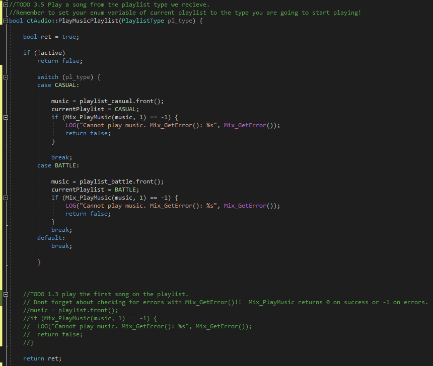

I am [Ricardo Gutiérrez](www.linkedin.com/in/ricardo-gutiérrez-5a7a0b161), student of the [Bachelor’s Degree in Video Games by UPC at CITM](https://www.citm.upc.edu/ing/estudis/graus-videojocs/). This content is generated for the second year’s subject Project 2, under supervision of lecturer [Ricard Pillosu](https://es.linkedin.com/in/ricardpillosu).

# Introduction

In this guide I'll walk you through 2 different audio related problems we might need to take the audio on our game to the next step. Firstly we'll talk about a general music manager and some of the features in it. Later on, we'll see spacial audio, were we'll be able to hear audio coming from 360 angles.

# Music Manager

Firstly I'd like to recommend having the SDL_mixer [wiki](http://sdl.beuc.net/sdl.wiki/SDL_mixer) ready to look up any useful function we might use. Let's start by taking a look at the audio module *ctAudio*.
For this part we'll mostly use and create functions under the MUSIC label. 

## Basic Music Functions

* **PlayMusic:** This will allow us to start playing music giving the path to the file, the amount of times we want it to loop (-1 for infinite) and a fade in and fade out time in case we are already playing a song.

* **StopMusic:** Here we'll just halt and free the music.

* **PauseMusic:** On the other hand, with this we'll be able to pause and unpause as we like. 

## Time to make a playlist!

Now this is were the real thing starts. We want to have a playlist of music that can loop over and over through the songs we add. Since we need [Mix_Music](http://sdl.beuc.net/sdl.wiki/Mix_Music) to load and play music, lets have a list of Mix_Music* that will allow us to push and pop either back or front as we need.

### TODO 1

Now go to the function **AddMusicToList** and add the music of the path recieved to your playlist. Once done, you can start to add songs to the playlist on the scene, in my case *ctMap*.

Now we'll need to play the music in our playlist. Take a look at **PlayMusic** function to have an idea on how we can start playing music. Don't forget to add LOG's using [Mix_GetError()](http://sdl.beuc.net/sdl.wiki/Mix_GetError) in case anything fails and we need to know what happened.

Now we can start playing our playlist on our scene.

### TODO 2

But what happens is that the first song plays and that's all. Now we'll need to somehow know when a song is finished to go onto the next one right? This is where [Mix_HookMusicFinished](https://www.libsdl.org/projects/SDL_mixer/docs/SDL_mixer_69.html) comes. This will allow us to set up a function to be called whenever a song ends.

So for now we only want a basic function SongFinished that will set a bool song_finished to true, then we'll work from there.

TIP:

MixHookMusicFinished asks for a normal function, not a member function and will give you this error if you do this mistake.

*Argument of type "void (ctAudio::*)()" is incompatible with paramater of type "void(*)()"

There are 2 ways to avoid this:

* Declare your function and bool as static members. This means that there will only be one instance of this variable shared between all instantiations of our App.

**static** void SongFinished();

**static** bool song_finished();

* Or the simplest solution, making the function and bool normal functions by declaring them outside the audio module.

In my case I'll use the second way.

And dont forget to link the function with MixHookMusicFinished

Now we will have a bool that will set true every time a song ends. Let's head to our game loop, in my case the Update function. Add a condition that will check if a song has just finished, and if its true cycle the music through the playlist and set our bool back to false so we don't end up coming back into this condition every game loop.

TIP:

Since in previous TODO 1.3 we started the playlist by the front, we will have to pop this and put it back at the end of the list. Don't forget to PlayMusicPlaylist again once you've done that.

Now we should be able to hear the songs we added to the playlist cycling over and over. *(Use songs: Short1.ogg, Short2.ogg and Short3.ogg for 5 to 10 secongs long songs to check how you did).*

[Check result here.](https://youtu.be/7p0nZ4ixSFI)

## Now lets make 2 playlists for different moods!

Now that we've learned how to make a playlist, we will go into the next step. Make 2 playlists.

We will differentiate this 2 by CASUAL and BATTLE playlists. What we want to accomplish is to have the playlists change whenever we approach certain enemy or zone in our game. In this case we will try to make music be peaceful on the black part of the map and on the cyan part we will enter a combat zone and change playlist.

### TODO 3

We will have to go over the previous TODO's and adjust them for 2 types of playlist.

First we will add an enum that will help us in the following steps.

We will also need to have 2 lists of Mix_Music for our playlist.

In order to know what playlist we are playing currently lets add a PlaylistType variable. And don't forget to make it start in CASUAL or BATTLE in our constructor.

For the last step on the .h we will have to adjust the parameters we recieve on AddMusicToList and PlayMusicPlaylist.

Now lets head into AddMusicToList and change it so we can add a song to one or the other playlist depending on what PlaylistType we recieve.

Next, lets do the same with PlayMusicPlaylist and adjust it so we play a song based on the playlist type we recieve. Remember to set your enum variable to the type of music you are playing!

For the final adjustment we will go into the song_finished condition on our Update. Same as before, we will have to cycle ONLY throught the playlist that is currently playing.

Then head to the map and make our calls have a playlist type!

Now we have all the necessary. Go to the loop of the map and uncomment a simple condition I made so that the music type changes once we enter the cyan area or we leave it.

[Check result here!](https://youtu.be/6YmzysdU530)

This is just a way to show you that to change playlist we only need to call PlayMusicPlaylist with the type we want, so feel free to change the condition to "Enemy can see me", "Entering boss room" or whatever you want inside your game!

## What to do now?

Now it's your turn to get creative. 

Do you want to have a different song every time you change zone? 

Do you want to return to the same second of a song you changed after entering combat? [This will help you](https://www.libsdl.org/projects/SDL_mixer/docs/SDL_mixer_65.html)

Remember to always keep the [wiki](http://sdl.beuc.net/sdl.wiki/SDL_mixer) close and everything will be fine!

# Spatial Audio

Let's move on to the next subject, spatial audio. Spatial audio is a feature that is not always needed in games, but placing it in the correct ones can really make a difference. I am mostly talking about games which require a high level of reactions and have a fast pace. If we are playing a game of Overwatch and attacks us one side or another, we have to be able to react by just hearing the shot. 

Other types of games can also benefit from this feature, always adding an extra reality and immersion to our games.

While we can work with SDL_mixer and it's functionalities to do this, I encourage you to go and learn OpenAL if what you want is a more precise and overall higher level of spatial audio.

If you are still here, lets start talking about some different things we might find working with fx that we didn't with music. While earlier we worked with Mix_Music, for fx we are going to work with [Mix_Chunks](https://www.libsdl.org/projects/SDL_mixer/docs/SDL_mixer_85.html). We also are going to start working with [channels](https://www.libsdl.org/projects/SDL_mixer/docs/SDL_mixer_25.html), that won't have a thing in common with music. SDL does this because while music are usually longer and only play one at a time, sound effects can be extremely short and play multiple at a time. The ammount of sounds we can play at a time will be decided by the ammount of channels we have, so if we have only 1 channel and try to play 2 sounds at the same time, one will play and the other one will start once the first ended. This is why we are going to allocate multiple channels so we don't run into this problem.

## Basic Fx Functions

* **LoadFx:** This will load a Mix_Chunk created from a path into an array with al Mix_Chunks.

* **PlayFx:** Basic function used to play a previouly loaded fx. We can set the ammount of times we want it to loop.

* **UnLoadFx:** Function we will use to clear and free our chunks.

## Spatial Audio Functions

*img GetAngle

* **GetAngle:** This function will return the angle between 2 points(x,y). Keep in mind this is how we will use angles from now on:

*img angulos

The center will be the player, so if we use GetAngle for an enemy that is at the left of the player, GetAngle will return 270.

*img GetVolumeFromDist

* **GetVolumeFromDistance:** Here, as the previos function, we will give 2 points and the function will calculate at what volume should we play a sound effect.

This defines will help you adjust this function to your liking.

* MAX_DISTANCE will set the maximum distance at which we will be able to hear sounds from an entity.

* VOLUME_AT_MAX_DIST will set the volume that the sound effects from entities further than MAX_DISTANCE will have. The loudest would be 0, while the quietest would be 255.

* NO_SOUND_DISTANCE if we don't want to hear sounds from entities past X distance this is what we have to change.

So if we use the values of defines set on the previous picture, this is what it would look like:

*img radar

If an enemy is inside the green zone, we will hear him from maximum volume to VOLUME_AT_MAX_DIST when green meets orange(MAX_DISTANCE). On the whole orange space we will alway hear sounds at VOLUME_AT_MAX_DIST. If we go into the red zone(NO_SOUND_DISTANCE) or further, we won't hear anything coming from that entity.

Keep in mind we will calculate volume according to the player. If we wanted to hear sounds according to the position of the camera, we should send the X and Y of the camera instead of the X and Y of the player in both functions.

*If you are following along with your own project don't forget to add #include<math.h> for some calculations happening in this functions*

## Let's begin!

The way we are going to do this is the following. In order to make sound come from an angle we will use [Mix_SetPosition](https://www.libsdl.org/projects/SDL_mixer/docs/SDL_mixer_82.html). This is the main function we will use to set the angle and distance (hence volume). Since we might want to be playing multiple sounds at the same time, we are going to allocate some channels. I did 360, one for each angle, but if you need to optimize your project you could try lowering the number.

Keep in mind we will need a good ammount of channels since, if we hear 5 sound coming from very close angles and don't have enough channels, we will have to either wait for one to end playing and right after play the next one or pass the sound to a close by channel that will play it in another angle. 

This last one can very well work with our 360 channels because SDL_mixer doesn't really perfect sound to every angle, so if we move a sound a few degrees to the side, it will remain unchanged. 

*SDL_mixer might play the same sound in angle 0 than angle 10, if you need more precision feel free to check out OpenAL*

### TODO 4

Allocate all channels you will need and set their angles. I will use SetChannelsAngles() that will set channel 0 with angle 0, channel 1 with angle 1, etc. Feel free to use a channel every 2 degrees or more if you want on your project.

*img 4.1

## TODO 5

Now that we have the channels ready to play audio in all directions its time to play an fx on the a channel according to its position and distance.

Remember the uint channel we recieve is the same as the angle from where the sound is coming. Check if the channel is in use, and if it is go onto the next one. *You can use [Mix_Playing](http://sdl.beuc.net/sdl.wiki/Mix_Playing) to check the state of the channel.*

If we reach channel 360, start over with channel 0.

